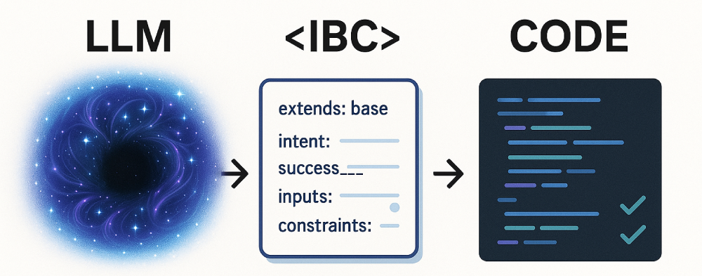

# Beyond Prompts: Taming AI Code Generation with Intent-Behaviour Contracts (IBCs)


## The Double-Edged Sword: AI Coding Assistants Today

Artificial intelligence is rapidly transforming software development. AI coding assistants promise unprecedented productivity boosts, generating code, translating languages, and even implementing features based on natural language.

However, the experience can often be frustratingly unpredictable:

*   **Context Collapse:** The AI forgets instructions, project structures, or constraints.
*   **Ambiguity Nightmares:** Vague prompts lead to incorrect interpretations.
*   **Consistency Catastrophes:** Generated code clashes with project styles and patterns.
*   **Going Off the Rails:** The AI modifies unrelated files or produces flawed logic.
*   **Loss of Control:** Developers spend excessive time correcting the AI's output.

We often feel like we're guiding a powerful but easily distracted entity rather than directing a capable assistant.

## Bridging the Gap: Current Attempts at Control

Strategies to manage AI assistants include:

1.  **Sophisticated Prompt Engineering:** Crafting detailed prompts requires skill, is hard to standardize, and remains vulnerable to context limits and drift.
2.  **IDE Rule Files (e.g., Cursor):** Providing static context (coding standards, forbidden paths) helps, defining the *environment* and *guardrails*. However, they don't specify the *intent and behavior* of the *task at hand*.

While valuable, these methods don't fully address the need for precise task specification.

## Introducing Intent-Behaviour Contracts (IBCs)

IBCs offer a structured approach: machine-readable specification files (e.g., YAML) that guide AI code generation reliably.

Think of it as providing an architectural blueprint instead of just describing a house.

## Simplified IBC Structure

Our IBC system follows a practical two-level hierarchy:

1.  **Base Configuration (`base.yaml`):** Contains global project settings:
    *   Technology stack and versions
    *   Coding conventions and style rules
    *   Project structure patterns
    *   File scope boundaries (allowed/forbidden paths)
    *   Default error handling and testing approaches

2.  **Task-Specific IBCs (e.g., `task-user-auth.yaml`):** Define individual features:
    *   **`extends: base`**: Inherits global rules from `base.yaml`.
    *   Defines specific **`intent`** (what & why) and **`success_criteria`**.
    *   Describes **`data`** models, inputs, and outputs.
    *   Specifies **`behaviors`** with inputs, outputs, and discrete steps.
    *   Sets **`constraints`** (security, performance).
    *   Provides **`implementation`** hints (dependencies, files to create).
    *   Outlines **`tests`** requirements.

This separates project-level concerns from task-level specifications, promoting consistency and maintainability.

## How to Use IBCs with AI

To leverage these IBCs for AI-assisted development:

1.  **Reference the Task IBC in your prompt**:
    ```
    "Please implement the user authentication service based on .ibc/task-user-auth.yaml"
    ```

2.  **Focus on Specific Behaviors within the IBC**:
    ```
    "Create the login functionality described in the 'login' behavior section of .ibc/task-user-auth.yaml"
    ```

3.  **Request Extensions or Modifications based on the IBC**:
    ```
    "Add password reset capability to the auth service, updating .ibc/task-user-auth.yaml first, then implement the changes."
    ```

## Example Workflow: Define First, Prompt Later

The workflow shifts towards upfront specification:

1.  **Define:** Create or refine the `task-*.yaml` file for the feature. Think through requirements, data flow, behavior steps, and constraints.
2.  **Prompt:** Reference the *specific* IBC file in your prompt to the AI.
3.  **Implement:** The AI reads both `base.yaml` and the relevant `task-*.yaml` and generates code according to the combined specification.
4.  **Review & Iterate:** Review the AI's output. If changes are needed, refine the code *or*, preferably, refine the *IBC specification* and ask the AI to regenerate based on the updated contract.

## How IBCs Elevate AI-Assisted Development

This structured approach offers significant advantages:

*   **Clarity:** Reduces ambiguity compared to natural language alone.
*   **Explicit Context:** Provides stable global and focused task context.
*   **Developer Control:** The developer defines the contract; the AI fulfills it.
*   **Consistency:** Global standards from `base.yaml` ensure coherence.
*   **Guided Implementation:** Steers the AI towards the desired solution.
*   **Testability:** Defining tests upfront promotes verifiable code generation.
*   **Maintainability:** IBC files act as versionable design artifacts.

## Creating New Task IBCs

When creating a new task IBC:

1.  Use the file naming pattern `task-{feature-name}.yaml`.
2.  Include `extends: "base"` in the `metadata` section.
3.  Define a clear `intent` with measurable `success_criteria`.
4.  Specify all required `data` models and `behaviors` with detailed steps.
5.  Include `implementation` hints (dependencies, files) specific to the task.
6.  List necessary `tests` to verify correctness.

## Best Practices

1.  **Keep `base.yaml` Minimal:** Include only truly global settings.
2.  **One Task per IBC:** Focus each task file on a cohesive feature.
3.  **Be Explicit:** Define clear inputs, outputs, and steps for behaviors.
4.  **Include Constraints:** Specify non-functional requirements (security, performance).
5.  **Define Tests:** Outline how the implementation should be verified.

## A More Mature AI Partnership

IBCs represent a significant step beyond basic prompting and static rule files. They foster a true partnership: the developer acts as the architect defining the blueprint (IBC), while the AI acts as a skilled builder executing the plan.

*   **vs. Prompt Engineering:** IBCs offer structure, reusability, maintainability, and reduced ambiguity.
*   **vs. Rule Files:** IBCs build upon rule files by adding the crucial layer of dynamic, task-specific behavioral specification.

## Conclusion: Towards Predictable AI Coding

Intent-Behaviour Contracts offer a structured, specification-driven approach to mitigate the unpredictability of AI coding assistants.

While requiring an upfront investment in writing specifications, the potential benefits – increased predictability, better code quality, enhanced control, and improved maintainability – pave the way for harnessing AI in software development more effectively and reliably.

IBCs provide a template for thinking, a structure for communication, and a contract for execution in the era of AI-assisted coding. 